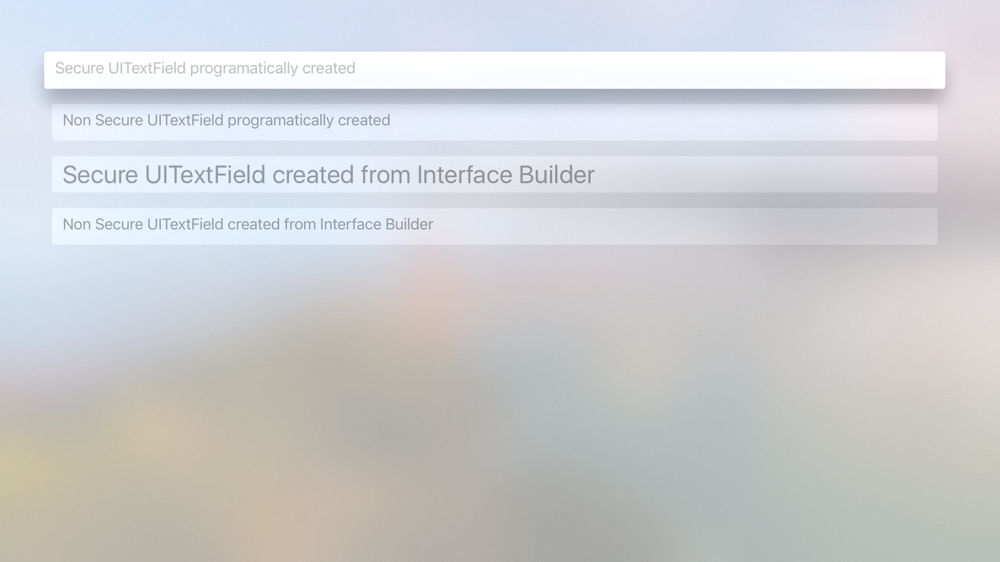

# Radar-30943855

Project created to report bug on UITextField for tvOS

· Open radar: https://openradar.appspot.com/30943855

# Description
When an intance of UITextField is created from Interface Builder, it ignores the property NSFontAttributeName set to attributedPlaceholder when isSecureTextEntry is set to `true`

# Expected 
The placeholder takes the font size defined by NSFontAttributeName regarless of how the instance of UITextField is created.

# Steps

In the project attached, 4 UITextFields are created:
- UITextField, programatically created with `isSecureTextEntry` equals to `true`
- UITextField, programatically created with `isSecureTextEntry` equals to `false`
- UITextField, created from Interface Builder, with `isSecureTextEntry` equals to `true`
- UITextField, created from Interface Builder, with `isSecureTextEntry` equals to `false`

